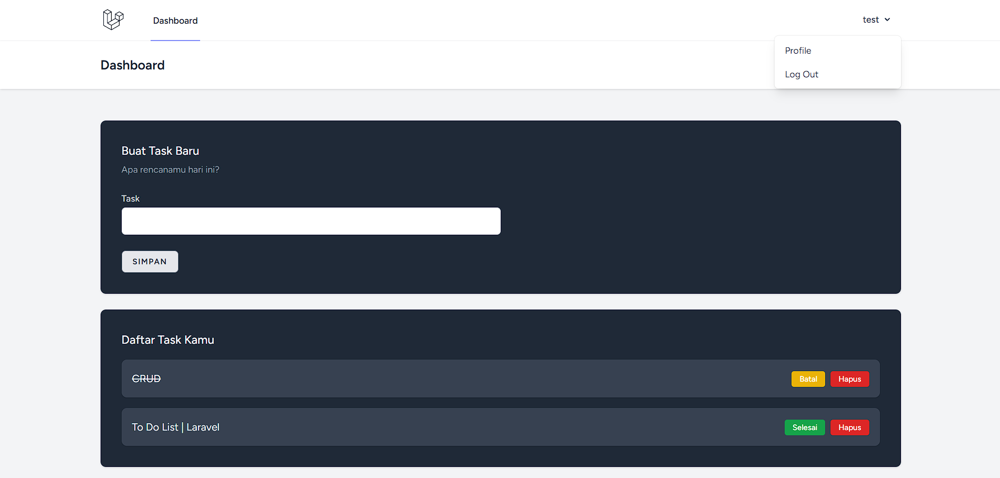

# Taskify: Laravel Task Manager

<p align="center">
  
</p>

Taskify adalah aplikasi manajemen tugas (To-Do List) full-stack yang dibangun menggunakan Laravel 12. Project ini mendemonstrasikan fundamental pengembangan web modern, termasuk arsitektur MVC, autentikasi, dan prinsip autorisasi yang aman.

Aplikasi ini adalah implementasi profesional dari proyek CRUD dasar, yang ditingkatkan dengan fitur-fitur penting untuk menunjukkan pemahaman mendalam tentang ekosistem Laravel.

---

## Fitur Utama

-   **Autentikasi User Lengkap:** Registrasi dan Login user yang aman menggunakan **Laravel Breeze** (Blade Stack).
-   **Full CRUD Tasks:** User dapat membuat (Create), membaca (Read), memperbarui (Update), dan menghapus (Delete) task.
-   **Autorisasi Berbasis Policy (Keamanan):** Implementasi **Laravel Policies** untuk memastikan user hanya dapat melihat, mengedit, atau menghapus task yang mereka buat sendiri. Mencegah user mengakses data milik user lain.
-   **Update Status Task:** Fungsionalitas Update (CRUD) digunakan untuk mengubah status task antara 'Pending' (Hijau/Kuning) dan 'Completed' (tercoret).
-   **Validasi Backend:** Menggunakan validasi Form Request (di Controller) untuk memastikan data (seperti 'title') wajib diisi.
-   **Desain Responsif:** Dibangun dengan Tailwind CSS untuk UI yang bersih dan fungsional di desktop dan mobile.

---

## Tech Stack

-   **Framework:** Laravel 12
-   **Frontend:** Blade Templates & Tailwind CSS
-   **Database:** MySQL (dijalankan via Laragon)
-   **Scaffolding & Autentikasi:** Laravel Breeze

---

## Panduan Instalasi (Lokal)

Project ini menggunakan stack Laravel standar dan dapat dijalankan di lingkungan server lokal seperti Laragon atau Valet.

1.  Clone repositori ini:
    ```bash
    git clone https://github.com/muhtegaralfikri/taskify-laravel.git
    cd taskify-laravel
    ```

2.  Install dependensi Composer (PHP):
    ```bash
    composer install
    ```

3.  Salin file environment dan konfigurasikan database (`.env`):
    ```bash
    cp .env.example .env
    ```
    *(Pastikan setting DB_DATABASE, DB_USERNAME, dan DB_PASSWORD di file .env sesuai dengan setup database lokalmu, misal: `db_taskify`, `root`, ``)*

4.  Generate kunci aplikasi Laravel:
    ```bash
    php artisan key:generate
    ```

5.  Install dependensi NPM (Frontend):
    ```bash
    npm install
    ```

6.  Jalankan migrasi database (untuk membuat tabel `users` dan `tasks`):
    ```bash
    php artisan migrate
    ```

7.  Jalankan server:

    **Cara A: (Menggunakan Laragon - Seperti project ini)**
    * Pastikan Laragon berjalan dan me-resolve domain (cth: `taskify-laravel.test`) ke folder `/public` project ini.
    * Jalankan Vite watcher: `npm run dev`

    **Cara B: (Menggunakan Artisan Serve)**
    * Di terminal 1, jalankan server PHP: `php artisan serve`
    * Di terminal 2, jalankan Vite watcher: `npm run dev`
    * Akses aplikasi di `http://localhost:8000`.

8.  Buka aplikasi di browser dan register akun baru.